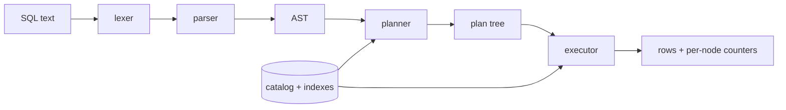

# TinySQL

[](LICENSE)

A from-scratch SQL engine in TypeScript with a visible query planner. You write a query, and the
right-hand panel shows the plan the engine actually ran — which table it scanned, where it used an
index, how many rows each step estimated, and how many it really produced. Everything runs in the
browser; the same engine code runs under Node for the tests and the CLI.

**This is not SQLite.** There is no `sql.js`, no SQLite.wasm, no DuckDB, no third-party SQL parser.
The lexer, parser, planner, executor and hash index are all in [`src/engine`](src/engine), in about
2,300 lines. It implements a small dialect, on purpose, so that the interesting part — deciding
between a sequential scan and an index lookup — stays readable.

## Quick start

```bash
npm install
npm run dev
```

Then open the printed URL. Three datasets load on their own.

```bash
npm test          # 103 tests
npm run build     # static site in dist/
```

The CLI runs the same engine over CSV files:

```bash
npm run cli -- --file public/datasets/employees.csv --file public/datasets/departments.csv --query "SELECT e.name AS employee, d.name AS department FROM employees e JOIN departments d ON e.dept_id = d.id WHERE e.dept_id = 3"
```

```
employee           department
-----------------  -----------
Ada Lovelace       Engineering
Grace Hopper       Engineering
...

7 rows · 4.3 ms · 108 rows touched · no index used
```

Add `--explain` to see the plan instead of the rows. `npm run cli -- --help` lists every flag.

> The package is not published to npm, so there is no `npx tinysql`. `npm run cli --` is the
> invocation that works in a fresh clone.

## Try this

Run it, look at the plan, then run it again after creating the index:

```sql
EXPLAIN SELECT e.name AS employee, d.name AS department
FROM employees e
JOIN departments d ON e.dept_id = d.id
WHERE e.dept_id = 3;

CREATE INDEX emp_dept ON employees (dept_id);
```

The `SeqScan` under the join becomes an `IndexLookup`. Note the aliases on the output columns —
without them the result would have two columns both called `name`.

Forty rows are too few to feel. Press **Generate 50k orders** in the schema panel, query
`WHERE employee_id = 17`, then add the index and run it again: on this machine that is 19.6 ms and
50,000 rows touched before, 2.8 ms and 1,149 rows touched after. Same answer, less work — which is
the entire point of a planner.

## How it fits together



The catalog is the only mutable state. The lexer, parser, planner and executor are pure functions of
their input and the catalog. See [ARCHITECTURE.md](ARCHITECTURE.md) for the data flow and the
estimate formulas.

## How indexes work

An index is a hash map from a tagged key to a list of row ids, built over one column. Keys are tagged
by **runtime** type — `n:1`, `t:1`, `b:true` — so `1` and `'1'` land in different buckets while `1`
and `1.0` land in the same one. That last part matters: INTEGER and REAL are one runtime numeric
domain, and an index that split them would make `WHERE x = 1.0` miss rows that a scan would find.

The planner uses an index when all of the following hold:

1. A `WHERE` conjunct (after splitting on `AND`) has the form `col = literal`, in either operand
   order, with a non-NULL literal. `= NULL` is UNKNOWN and never an index hit.
2. The column **resolves** to a `(table, column)` pair that has an index. Resolution follows table
   aliases, so `WHERE e.dept_id = 3` finds the index on `employees(dept_id)`.
3. The conjunct references exactly one relation, so it can be **pushed below the join**. Without
   pushdown, an index could never fire in a join query.

The remaining conjuncts stay in a `Filter`: single-relation ones directly above that relation's scan,
join-spanning ones above the join. At most one `IndexLookup` per relation.

`tests/planner.test.ts` asserts on the serialized plan tree, and `tests/executor.test.ts` runs every
probe value against both an indexed and an unindexed catalog and requires identical rows. An index
that changes the answer is the worst bug this codebase could have, so it is tested as a property
rather than as an example.

## Supported SQL

```
CREATE TABLE name ( col type [, col type]* );
CREATE INDEX name ON table ( col );
DROP TABLE name;
INSERT INTO name ( cols ) VALUES ( v [, v]* ) [, ( v [, v]* )]* ;
SELECT [DISTINCT] items
  [FROM table [alias]]
  [JOIN table [alias] ON qualified.col = qualified.col]
  [WHERE expr]
  [ORDER BY col [ASC|DESC] [, ...]]
  [LIMIT n [OFFSET n]];
EXPLAIN SELECT ...;
```

- **Types:** `INTEGER`, `REAL`, `TEXT`, `BOOLEAN`, `NULL`. CSV import infers INTEGER / REAL / TEXT;
  an empty cell is NULL.
- **Select items:** `*`, `table.*`, `col`, `table.col`, `expr AS alias`. `FROM` is optional, so
  `SELECT 1 AS n` works.
- **Operators:** `= != <> < <= > >= AND OR NOT`, parentheses, `IS NULL`, `IS NOT NULL`, `LIKE` with
  `%` and `_`.
- **Literals:** integers, reals, single-quoted strings with `''` as an escaped quote, `TRUE`,
  `FALSE`, `NULL`.
- **Identifiers:** unquoted `[A-Za-z_][A-Za-z0-9_]*`, or double-quoted to preserve case. Keywords are
  case-insensitive; unquoted names fold to lowercase.
- **Comments:** `--` to end of line, and `/* ... */`.

### Value semantics worth knowing

These are decisions, not accidents, and each one has a test:

- Values of different types are **never equal**. `1 = '1'` is FALSE. When ordered, types rank
  `null < boolean < number < text`.
- `1` and `1.0` are the same value.
- **Three-valued logic everywhere.** Any comparison or `LIKE` with a NULL operand is UNKNOWN.
  `WHERE` keeps TRUE only, so both `dept_id = 3` and `dept_id != 3` exclude a NULL `dept_id`.
- `DISTINCT` treats two NULLs as duplicates of each other — the opposite of `=`, and what SQL says.
- `ORDER BY` puts NULLs **first** ascending, last descending (SQLite's order; Postgres does the
  reverse).
- `ORDER BY` may name any column from `FROM`/`JOIN`. With `DISTINCT` it must name a column in the
  select list, because the sort then has to run after the projection.
- `LIKE` is case-sensitive.
- Dates are TEXT. The bundled data uses ISO-8601 (`2026-07-04`) so that `>` compares chronologically.

### Limits

Single-threaded. A CSV over 20 MB or 200,000 rows is refused with a clear error.

## What we will never do in v1

No transactions. No `UPDATE` or `DELETE`. No `LEFT JOIN` — inner equijoin only, one join per query.
No aggregates, no `GROUP BY`, no subqueries, no `UNION`, no views. No server, no accounts, no AI
anything. Persistence is `localStorage` for the editor text and nothing more.

## Adding a statement type

Four edits, in this order:

1. **`src/engine/ast.ts`** — add the node interface and put it in the `Statement` union.
2. **`src/engine/parser.ts`** — add a `parseX()` and dispatch to it from `parseStatement()`. Report
   what you expected; never invent a token.
3. **`src/engine/executor.ts`** — add a case to `executeStatement()`. If it reads rows it belongs in
   the planner instead, as a new `PlanNode` kind plus a case in `execNode()`.
4. **`tests/`** — a parser test for the syntax and an executor test for the behaviour. If the test is
   awkward to write, the API is wrong; fix the API.

The TypeScript union types will tell you everywhere else you need to touch: `noImplicitAny` is on,
there are no `any` casts, and the switch statements are exhaustive.

## Layout

```
src/engine/   lexer, parser, planner, executor, catalog, hash index, CSV — no DOM
src/ui/       editor, schema panel, results grid, plan view, status bar, dropzone
src/cli/      the Node entry point
tests/        one file per engine module, plus a golden test over the bundled CSVs
public/datasets/  employees, departments, orders
docs/         the build specification this repo was written against
```

`npx tsc -p tsconfig.node.json` typechecks the engine and CLI with DOM types removed, which proves
the engine has no browser dependency.

## License

MIT — see [LICENSE](LICENSE).
